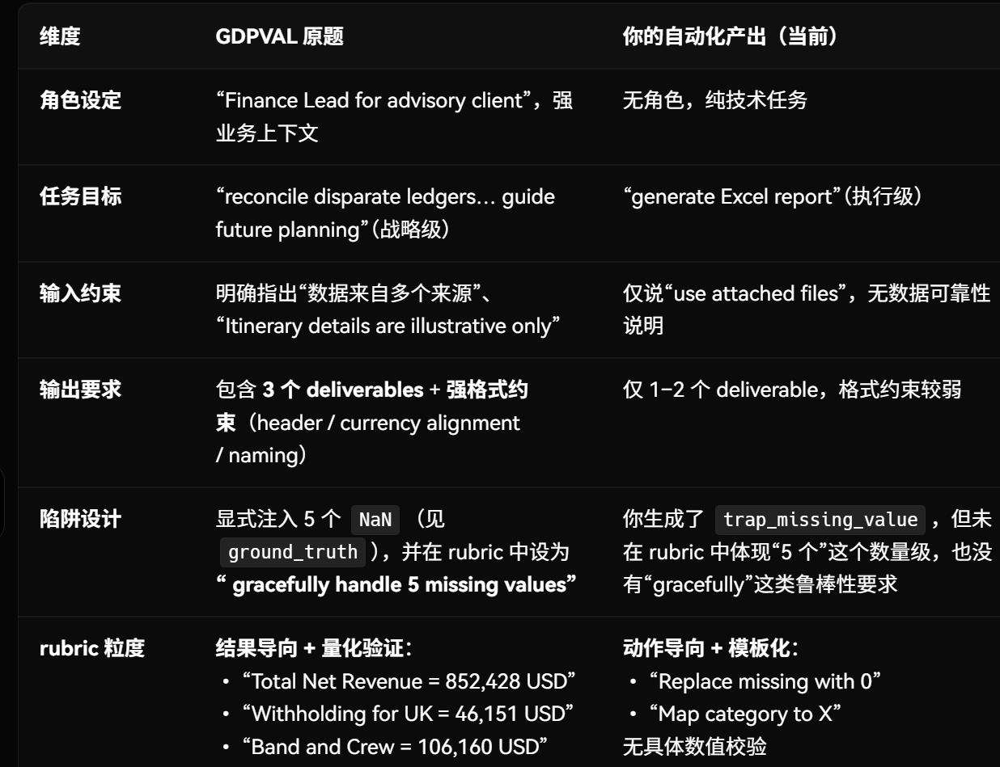

# 一、 工作进展情况

在完成初版“考点提炼流水线”后，本项目进入了深度架构优化与联调阶段。针对初期暴露出的数据质量、格式稳定性和系统连通性问题，我们进行了大量的核心代码重构与逻辑升级，确保流水线能够稳定产出高质量、高逻辑自洽性的测试数据。具体进展如下：

## 1. 双智能体验证架构落地：

为了解决核心考点提炼环节频发的大模型格式幻觉问题，引入了两个LLM进行辩论的机制。

- 在代码层面加入了 JSON 截断拦截与异常重试逻辑；
- 在架构层面引入了 LLM Judge，根据预设的 Rulebook 对生成内容进行严格的二次校验。
- 加入辩论日志记录，便于清晰追溯大模型的纠错过程。

## 2. 考点提炼逻辑优化：

- 引入“Export”节点类型。在 DAG 图谱架构中正式增设了独立的 Export 节点，统一了数据流入与流出的规范。
- 暂时放弃考点查重。直接让生产的考点入库。

# 二、当前问题的分析

目前，我们的考点提炼流水线已经基本成功实现了复杂任务图谱的精细化拆解与底层物理数据的自动化生成，但仍需更多测试以保证提炼的考点绝对准确无误。

然而，在对比业界高标准评测任务（如 GDPVAL）后，我们发现在题干（Prompt）的表达和评分标准（Rubric）的设计上存在明显的“机器感”，导致生成的考题对大模型（LLMs）的区分度不佳。

具体表现在以下两个方面：

**1. 题干（Prompt）的“伪代码化”与“提前剧透”**  
- 过度暴露中间过程：当前的题干由底层的 Mutator 节点直接翻译而来（自底向上拼接），导致它像一份按部就班的“数据处理说明书”。模型只需充当“按注释写代码”的打字机，无需进行业务建模的思考。
- 陷阱失效：题干中显式提示了“请处理空值/异常”，这相当于在考前告诉考生“这里有坑”，使得本应用于考察大模型数据敏锐度和容错能力的 Trap 节点彻底失去了选拔价值。

**2. Rubric 的“动作打分化”与“低区分度”**  
- 当前的 Rubric 高度绑定执行动作（如“是否将空值替换为 0”），缺乏对“结果一致性”和“负向错误模式”（如何用错误的统计方法导致雪崩）的检验。
- 限制了解题路径：如果模型采用了更高效的 Pandas 逻辑组合了中间步骤，反而可能由于不符合预设的“单步 Rubric 动作”而遭到误判。

**3. GDPVAL 原题 vs 我生成的题目**

# 三、后续改进计划

## 1. “考点” 的重新定位

- “考点”是出题人造题的步骤，而不是做题者做题的步骤
- 图谱是系统的“物理执行蓝图”，其核心价值是驱动自动造题引擎去生成复杂的上下游测试数据并穿插陷阱。题干和 Rubric 只是附着在数据蓝图上的一层“业务外衣”，绝对不能与底层代码步骤一一对应。

## 题干的生成需要从“过程指令式”走向“目标声明式”

需要明确告知：
- 输入背景：提供沉浸式的 Role-play（例如：“你是某顾问公司的财务主管”），交代业务目标。
- 绝对约束规则：提供无法推理出的外部业务参数（如各国的税率标准）。
- 最终交付物要求：明确最终需要呈现的报表结构、聚合维度（如按 Source 结算）和文件格式。

需要在题干中隐匿：
- 隐匿 Trap 节点：只字不提数据可能存在缺失、异常
- 隐匿过渡态 Mutator 节点：交代过滤、连表、临时列计算的具体顺位与代码逻辑。
- 抹除类似“Hard Constraints”、“Output Dependency”等机器格式，用自然流畅的业务语言提出要求。

## Rubric 的升级

部分中间步骤从题干中消失后，“如何对其进行评分”成了关键。我们需要摒弃“动作核验（检查模型是否做了某事）”。

**1. 结果核验**
- 出题的时候就把关键步骤的答案算出来。直接对最终结果进行核验，确保其满足业务目标。
- 示例：不考察“你是否对粗利润和税率进行了乘法并相减”，而是通过 Rubric 考察 “The net income for Production Company strictly equals -182,393 USD”。只要中间的连表、算税、或 5 个故意留空的 NaN 没有被正确处理，这个数字就绝对对不上。

**2.能力维度分层**  
在接下来的 Rubric 生成管线（Agent 5）中，不再由语义直接生成打分项。将 Rubric 严格分为三个考核维度：

- 维度 1：Fact（事实与结果维度）
  - 过去的写法（过程式）：“The model calculates Total Net Revenue and Total Expenses across all sources.”（检查它有没有算这对总和）
  - 现在的写法（对账式）：“The final P&L report must accurately display the absolute 'Total Net Revenue' as 852,428 USD and 'Total Expenses' as 310,200 USD.”
  - 能力内核：大模型做数学计算往往会犯错（幻觉、精度丢失）。直接拿着标准答案去对账，只要金额对了，意味着中间所有的常规聚合、连表动作都是100%正确的。

- 维度 2：Reasoning（业务逻辑推理）——“懂得业务常识”
  - 过去的写法（过程式）：“Calculate Net Revenue by subtracting the tax from Gross Revenue.”（直接把公式喂给它并检查）
  - 现在的写法（推理式）：“The model correctly deduces that the local witholding tax (e.g., 20% for the UK) must be deducted from the gross amount before converting to USD, resulting in a correct net margin for the Production Company.”
  - 能力内核：在题干中，并没有告诉模型“先扣税还是先算汇率”。由于各国税是对“本土发生额”扣除的，模型必须自己具备这点业务常识（或者推理出来）。在 Rubric 里，我们检查的不是减法，而是检查那些需要通过业务推理才能推导出的正确列依赖关系。

- 维度 3：Robustness（鲁棒性与边界防御）——“优雅地面对混乱”
  - 过去的写法（过程式）：“Identify and handle missing values in Gross Revenue.”（检查是否调用了数据清理函数）
  - 现在的写法（边界测试）：“Despite the intentional injection of 5 missing 'Gross Revenue' entries in the raw data, the final aggregated Net Income does not propagate NaN, #DIV/0!, or infinite values. The model gracefully imputes or excludes these anomalies without compromising the validity of the other 145 clean rows.”
  - 能力内核：这就是处理 Trap 节点的要求。一个好的大模型应当：读取数据 -> 发现缺了 5 行金额 -> 决定是填充均值还是直接丢弃该笔交易 -> 继续往下走。Robustness 维度的 Rubric 不规定你怎么修补，只要求“整个流水线不能因为这 5 个坑而崩溃，并且最终的报告依然整洁有效”。